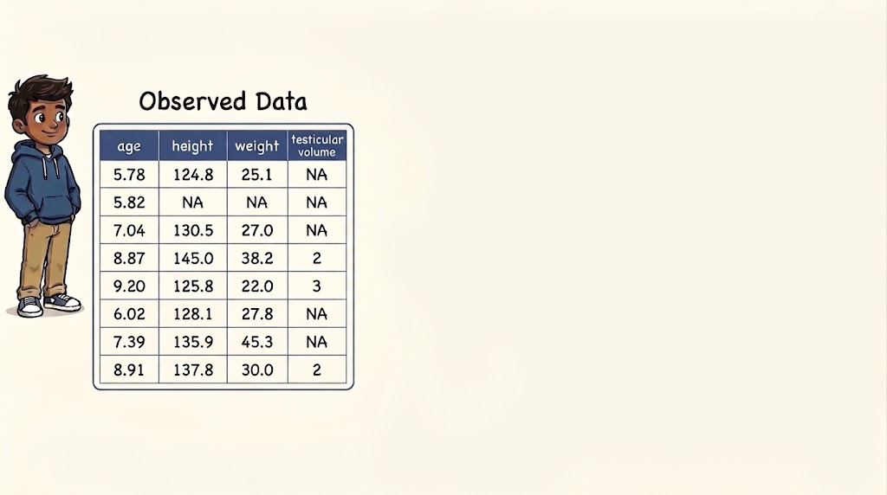
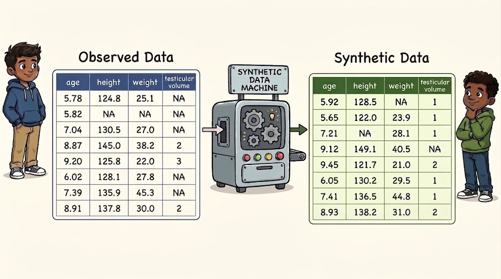

## Synthetic data

:::{.r-stack}

{.fragment .fade-out fragment-index=1}

{.fragment .fade-in fragment-index=1}

:::


<!-- ## Synthetic data

> Synthetic data is data that is generated from a statistical model, as opposed to real, collected data

<br>

_Fake data, generated data, digital twins_ -->

## Is anonymizing not enough? 

If done well, anonymization might suffice.

But: data might be linked in surprising ways.

With enough variables, every record becomes unique.

## Netflix prize data

Dataset with movie ratings provided by Netflix: movie rating (1-5); submission date

:::{.fragment}

:::{.emph}

Narayanan & Shmatikov ([2008](https://systems.cs.columbia.edu/private-systems-class/papers/Narayanan2008Robust.pdf)) showed that 99% of the records can be identified based on

- 8 movie ratings of which 2 were allowed to be incorrect, and dates within a 2 weeks margin.

- Movie ratings can be obtained from external data sources

:::

:::


## Synthetic data generation outline

1. Privacy risk assessment: _anonymization; identifying sensitive variables_

2. What's the goal of the synthetic data: _Dummy data, teaching, replication, novel research_?

3. Choosing a synthetic data model _that fits this goal_

4. Evaluating risk and utility

5. Refinements necessary?

## Generating synthetic data

Capture the most important information about the data in a *generative* model

- Parameters are learned from real data; as opposed to simulated data

- Information that flows into the model can be bounded

- Relationships in real data can be modelled explicitly

Draw new samples from this model


# Don't you ever!


## Conditional modelling

One (regression) model per variable

- Offers a lot of flexibility

- Allows easy model checking (posterior predictive checks)

- Easier to make refinements

- Transparent what information ends up in synthetic data

__Software__: [synthpop](https://www.synthpop.org.uk/)^[Nowok, Raab & Dibben (2016): [https://www.synthpop.org.uk/](https://www.synthpop.org.uk/)] (`R`, `python`); [simPop](https://github.com/statistikat/simPop) (`R`)^[Templ, Meindl, Kowarik & Dupriez (2017): [https://github.com/statistikat/simPop](https://github.com/statistikat/simPop)]

## (Non-parametric) joint modelling

Often based on deep learning

Superior for unstructured data (images, geo-spatial data, fMRI)

Hard to know and communicate what information ends up in the synthetic data

__Software__: [Synthetic Data Vault (sdv)](https://github.com/sdv-dev/sdv)^[Patki, Wedge & Veeramachaneni (2016): [https://github.com/sdv-dev/sdv](https://github.com/sdv-dev/sdv)], [synthcity](https://github.com/vanderschaarlab/synthcity)^[Qian, Cebere & van der Schaar (2023): [https://github.com/vanderschaarlab/synthcity](https://github.com/vanderschaarlab/synthcity)]; [RGAN](https://github.com/mneunhoe/RGAN)^[Neunhoeffer (2026): [https://github.com/mneunhoe/RGAN](https://github.com/mneunhoe/RGAN)].

## The privacy-utility trade-off

```{r}
#| echo: false
#| message: false
#| warning: false
library(ggplot2)

ggplot(data = data.frame(
  x = c(0.01, 0.95, 0.95, 0.25),
  y = c(-0.05, -1, -0.05, -0.5),
  label = c("Pure noise", "Original data", "Probably unattainable\noptimal release", "Typical release")
), mapping = aes(x = x, y = y, label = label)) +
  stat_function(aes(col = "Theoretical boundary"), fun = \(x) -x^2, linewidth = 1) +
  xlim(0, 1) +
  theme_classic() +
  theme(axis.text = element_blank(),
        axis.ticks = element_blank(),
        legend.position = "inside",
        legend.position.inside = c(0.15, 1.02),
        legend.background = element_rect(fill = '#fffbf2'),
        panel.background = element_rect(fill = '#fffbf2'),
        plot.background = element_rect(fill = '#fffbf2')) +
  xlab("Utility") +
  ylab("Privacy") +
  geom_point() +
  geom_text(aes(hjust = c(-0.1, 1.1, 1.1, 1.1))) +
  scale_color_manual(values = c("#009933"))
```

## The privacy-utility trade-off illustrated

```{r}
#| echo: false
#| message: false
#| warning: false
#| fig-width: 9
#| fig-height: 7

set.seed(123)

data <- mice::boys
meth <- mice::make.method(data)
meth["bmi"] <- "~I(wgt/(hgt/100)^2)"
predmat <- mice::make.predictorMatrix(data)
predmat[c("hgt", "wgt"), "bmi"] <- 0

imp <- mice::mice(
  data, 
  method = meth, 
  predictorMatrix = predmat,
  maxit = 20, 
  m = 1,
  print = FALSE
)

data <- mice::complete(imp)

minidata <- data[seq(1, nrow(data), length.out = 25), ]

library(ggplot2)
library(patchwork)

# create new test data set to plot the lines
modeldata <- data.frame(
    age = seq(0, max(minidata$age), length.out = 1001)
)

# simple linear regression model
simple_fit <- lm(tv~age, data = minidata)
simple_pred <- predict(
    simple_fit, 
    newdata = modeldata,
    interval = "prediction"
)

# minimum norm spline
df <- 32
complex_x <- splines::ns(minidata$age, df = df, intercept = TRUE)
SVD <- svd(complex_x)
# calculate minimum norm regression coefficients
complex_fit <- SVD$v %*% ((t(SVD$u) %*% minidata$tv) / SVD$d)
# create test data spline
xnewspline <- splines::ns(modeldata$age, df = df,
                          knots = attr(complex_x, "knots"), 
                          Boundary.knots = attr(complex_x, "Boundary.knots"),
                          intercept = TRUE)
# calculate predicted values
complex_pred <- xnewspline %*% complex_fit

# calculate more or less correct model
right_fit <- lm(sqrt(tv) ~ splines::ns(age, knots = c(7, 16)), minidata)
right_pred <- predict(right_fit, newdata = modeldata, interval = "prediction")

unsign_sq <- \(x) sign(x) * x^2

color_scale <- RColorBrewer::brewer.pal(3, "Set1")
names(color_scale) <- c(
    "Right balance", "Privacy disaster", "Poor utility"
)

basic <- ggplot() +
    geom_point(aes(x = minidata$age, y = minidata$tv)) +
    scale_color_manual(name = "Synthesis model", values = color_scale) +
    theme_minimal() +
    ylim(-10, 40) +
    labs(x = "Age", y = "Testicular volume") +
    theme(
      legend.position = "bottom",
      panel.background = element_rect(fill = '#fffbf2'),
      plot.background = element_rect(fill = '#fffbf2')
    )


basic +
    geom_line(
        aes(
            x = modeldata$age, 
            y = unsign_sq(right_pred[,1]),
            col = "Right balance"
        )
    ) +
    geom_line(
        aes(
            x = modeldata$age, 
            y = complex_pred,
            col = "Privacy disaster"
        )
    ) +
    geom_line(
        aes(
            x = modeldata$age, 
            y = simple_pred[,1],
            col = "Poor utility"
        )
    ) +
    ylim(-2, 30)
```


## Bounding information flow into synthesis model

Traditionally: restricting to simpler models 

- (Generalized) linear models; identifying influential cases (leverage; degrees of freedom per parameter)

For non-parametric models:

- Regularization

- Differential privacy

# Differential privacy

:::{.emph-header}
Only formal privacy framework as of yet
:::

- Sensitivity: the maximum influence a single individual can have on a model

- Adds noise such that the results are almost equivalent regardless of whether this maximally influential individual was present in the data

## Differential privacy for a count

Say we have $n = 100$ individuals in our data without or with a disease (0/1)

```{r}
#| include: false
library(ggplot2)

f    <- c(26, 27)                 # f(D) and f(D')
b    <- 1                         # scale = Delta f / epsilon
lap  <- function(x, mu, b) exp(-abs(x - mu) / b) / (2 * b)
cols <- c("f(D) = 26" = "#1B2A5B", "f(D\u2032) = 27" = "#4A78C4")

x <- seq(22, 31, 0.01)
d <- rbind(data.frame(x, P = lap(x, f[1], b), f = names(cols)[1]),
           data.frame(x, P = lap(x, f[2], b), f = names(cols)[2]))

dmax <- 1 / (2 * b)                       # peak of the Laplace density
bars <- data.frame(x = f, P = dmax, f = names(cols))

p <- ggplot(d, aes(x, P, colour = f)) +
    geom_segment(data = bars, aes(x = x, xend = x, y = 0, yend = P),
                 linewidth = .8, linetype = 2) +
    annotate("segment", x = f[1], xend = f[2], y = dmax * 1.08, yend = dmax * 1.08,
             arrow = arrow(ends = "both", length = unit(.15, "cm"))) +
    annotate("text", x = mean(f), y = dmax * 1.17, label = "Delta*f == 1", parse = TRUE) +
    scale_colour_manual(values = cols, name = NULL) +
    coord_cartesian(xlim = range(x), ylim = c(0, dmax * 1.25)) +
    theme_minimal(base_size = 14) +
    theme(
      legend.position = "bottom",
      panel.background = element_rect(fill = '#fffbf2', colour = NA),
      plot.background = element_rect(fill = '#fffbf2', colour = NA)
    ) +
    labs(y = " ")
```

::: {.columns}

::: {.column width="45%"}

- Goal: estimate number of individuals with disease

- __Sensitivity__: Altering one individual affects our estimate by at most $1$

:::

::: {.column width="55%"}

::: {.r-stack}

::: {.fragment .fade-out fragment-index=1}

```{r}
#| echo: false
#| fig-width: 7
#| fig-height: 5
p
```

:::

::: {.fragment .fade-in fragment-index=1}

```{r}
#| echo: false
#| fig-width: 7
#| fig-height: 5
p +
    geom_line(linewidth = 1) +
    annotate("segment", x = 25, xend = 25, y = lap(25, 27, b), yend = lap(25, 26, b),
             colour = "grey40") +
    labs(y = "density")
```

:::

:::

:::

:::


## Advantages of synthetic data

Privacy can be well protected

- No real records anymore

- Information that goes into synthesis model can be bounded

A large amount of information can be preserved

- Important information can be modelled explicitly

## Disadvantages

Quality of synthetic data depends entirely on synthesis model

- Too simple models might omit important relationships 

- Complex synthesis models obscure what information is reproduced in the synthetic data

## Some helpful resources

- Overview: Drechsler & Haensch (2024). 30 years of synthetic data. Statistical Science, 39(2), 221-242.

- Tutorial: Volker (2025). Generating and evaluating synthetic data in R. LMU Open Science Center. [https://doi.org/10.5281/zenodo.18318778](https://doi.org/10.5281/zenodo.18318778)

- `synthpop` webpage with practical advice: [https://www.synthpop.org.uk/resources.html](https://www.synthpop.org.uk/resources.html)

# Questions / comments?

Feel free to reach out: [t.b.volker@uu.nl](mailto:t.b.volker@uu.nl)

Slides: [https://github.com/thomvolker/dgp-synthetic/](https://github.com/thomvolker/dgp-synthetic/)

