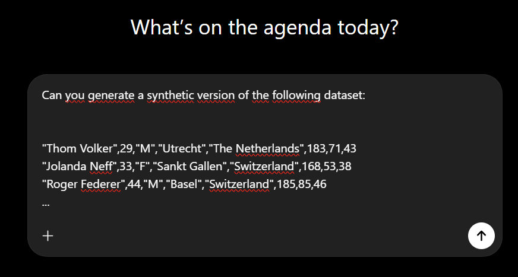
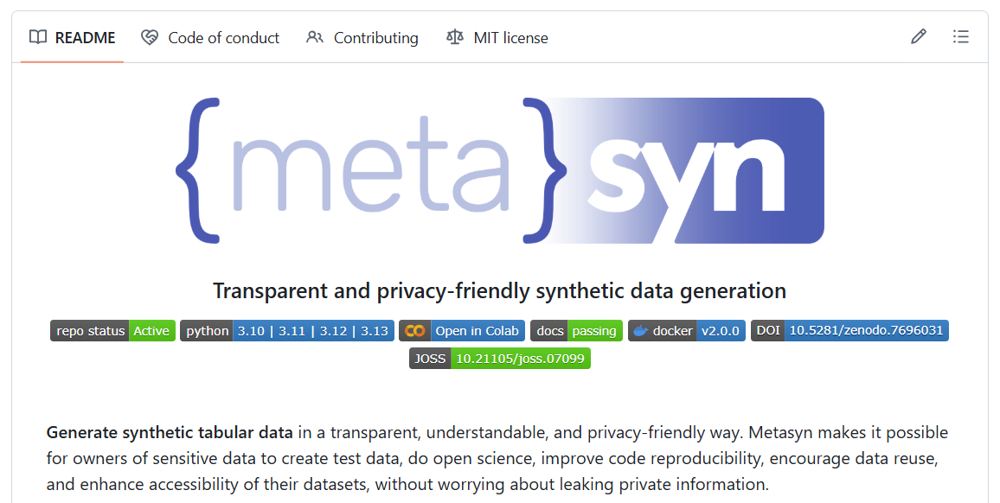

## Open data is the pinnacle of open science

::: {.columns}

::: {.column width="60%"}

- Transparency (_with analysis code_)
- Learning from colleagues
- Potential for follow-up analyses
- Eases research synthesis

:::

::: {.column width="25%"}


:::

:::


But when the data is sensitive, openly disseminating research data is not possible.

<!--
Content: open data; privacy concerns
Synthetic data: key goals; simple generating mechanism, more complex mechanisms
Connection to large language models and other deep learning models
Synthesis strategy
Synthesis model
Synthetic data quality
Privacy utility trade-off
Formal privacy guarantees
Software solutions and tutorials
-->

## When open data is not allowed ...

- Data is simply not available, bye!

- "Data is available upon reasonable request."

- Data is on a secure server with data access procedures.


:::{.fragment}
:::{.emph}
::: {.columns}
::: {.column width="60%"}

<br>

__Solution__: _synthetic data_

:::

::: {.column width="20%"}


:::

:::

:::
:::


## About me

::: {.columns}
:::: {.column width="60%"}
Thom Benjamin Volker

- Utrecht University \& Statistics Netherlands
- PhD. Candidate in Methodology and Statistics
::::

:::: {.column width="5%"}
<br>
::::

:::: {.column width="25%"}
{style="border-radius:30px; overflow:hidden; border:2px solid #12244d"}
::::

:::

__Research interests__: methods to enhance _data privacy_, _synthetic data_ and multiple imputation of _missing data_.

## About me

::: {.columns}
:::: {.column width="60%"}
_Thorben van Meij-Kolm_

- _DSM-Firmenich_
- _Data scientist_
::::

:::: {.column width="5%"}
<br>
::::

:::: {.column width="25%"}
{style="border-radius:30px; overflow:hidden; border:2px solid #12244d"}
::::

:::

__Research interests__: _forecasting, A/B testing_.

## Synthetic data

> Synthetic data is data that is generated from a statistical model, as opposed to real, collected data

<br>

_Fake data, generated data, digital twins_

## The goal of synthetic data

Capture the most important information about the data in a model

Generate new samples from this model

- What information flows into the model can be bounded

- Modelled relationships that appear in the real data are preserved

## The privacy-utility trade-off

```{r}
#| echo: false
#| message: false
#| warning: false
library(ggplot2)

ggplot(data = data.frame(
  x = c(0.01, 0.95, 0.95, 0.25),
  y = c(-0.05, -1, -0.05, -0.5),
  label = c("No data", "Original data", "Probably unattainable\noptimal release", "Typical release")
), mapping = aes(x = x, y = y, label = label)) +
  stat_function(aes(col = "Theoretical boundary"), fun = \(x) -x^2, linewidth = 1) +
  xlim(0, 1) +
  theme_classic() +
  theme(axis.text = element_blank(),
        axis.ticks = element_blank(),
        legend.position = "inside",
        legend.position.inside = c(0.15, 1.02),
        legend.background = element_rect(fill = '#fffbf2'),
        panel.background = element_rect(fill = '#fffbf2'),
        plot.background = element_rect(fill = '#fffbf2')) +
  xlab("Utility") +
  ylab("Privacy") +
  geom_point() +
  geom_text(aes(hjust = c(-0.1, 1.1, 1.1, 1.1))) +
  scale_color_manual(values = c("#009933"))
```

<!--TODO: Expand the conceptual introduction -->

## Is anonymizing not enough? 

If done well, anonymization might suffice.

But: data might be linked in suprising ways.

With enough variables, every record becomes unique.

# 

> Narayanan & Shmatikov ([2008](https://systems.cs.columbia.edu/private-systems-class/papers/Narayanan2008Robust.pdf)) identified 99% of the records in the (anonymized!) Netflix Prize Data based on some crude information

## Advantages of synthetic data

Privacy can be well protected

- No real records anymore

- Information that goes into synthesis model can be bounded

A large amount of information can be preserved

- Important information can be modelled explicitly

## Disadvantages

Quality of synthetic data depends entirely on synthesis model

- Too simple models might omit important relationships 

- Complex synthesis models obscure what information is reproduced in the synthetic data

## Generating synthetic data

1. Privacy risk assessment

2. What's the goal of the synthetic data?

3. Choosing the synthetic data model

4. Evaluating risk and utility

5. Refinements necessary?

## Privacy risk assessment

Anonymization: remove directly identifying information.

- Names, ID numbers, addresses, user ID's

- Often unique and hard to synthesize

Evaluate outliers: might be directly identifying

Identify sensitive variables: consider recoding and coarsening

## What should be achievable with the synthetic data?

- Dummy data?

- Teaching?

- Replication?

- Novel research?

:::{.fragment}
> Is the real data eventually available in a secure environment?
:::

## Generating synthetic data

You need a generative model

$$
f(D_{syn}|\theta)
$$

You require an (implicit or explicit) model $f$ for the data $D$ with parameters $\theta$

_Parameters are typically learned from real data; as opposed to simulated data._

# Don't you ever!




# Choosing a synthetic data model

> What information do you want to preserve?

## The privacy-utility trade-off once again

```{r}
#| echo: false
#| message: false
#| warning: false
#| fig-width: 9
#| fig-height: 7

set.seed(123)

data <- mice::boys
meth <- mice::make.method(data)
meth["bmi"] <- "~I(wgt/(hgt/100)^2)"
predmat <- mice::make.predictorMatrix(data)
predmat[c("hgt", "wgt"), "bmi"] <- 0

imp <- mice::mice(
  data, 
  method = meth, 
  predictorMatrix = predmat,
  maxit = 20, 
  m = 1,
  print = FALSE
)

data <- mice::complete(imp)

minidata <- data[seq(1, nrow(data), length.out = 25), ]

library(ggplot2)
library(patchwork)

# create new test data set to plot the lines
modeldata <- data.frame(
    age = seq(0, max(minidata$age), length.out = 1001)
)

# simple linear regression model
simple_fit <- lm(tv~age, data = minidata)
simple_pred <- predict(
    simple_fit, 
    newdata = modeldata,
    interval = "prediction"
)

# minimum norm spline
df <- 32
complex_x <- splines::ns(minidata$age, df = df, intercept = TRUE)
SVD <- svd(complex_x)
# calculate minimum norm regression coefficients
complex_fit <- SVD$v %*% ((t(SVD$u) %*% minidata$tv) / SVD$d)
# create test data spline
xnewspline <- splines::ns(modeldata$age, df = df,
                          knots = attr(complex_x, "knots"), 
                          Boundary.knots = attr(complex_x, "Boundary.knots"),
                          intercept = TRUE)
# calculate predicted values
complex_pred <- xnewspline %*% complex_fit

# calculate more or less correct model
right_fit <- lm(sqrt(tv) ~ splines::ns(age, knots = c(7, 16)), minidata)
right_pred <- predict(right_fit, newdata = modeldata, interval = "prediction")

unsign_sq <- \(x) sign(x) * x^2

color_scale <- RColorBrewer::brewer.pal(3, "Set1")
names(color_scale) <- c(
    "Right balance", "Privacy disaster", "Poor utility"
)

basic <- ggplot() +
    geom_point(aes(x = minidata$age, y = minidata$tv)) +
    scale_color_manual(name = "Synthesis model", values = color_scale) +
    theme_minimal() +
    ylim(-10, 40) +
    labs(x = "Age", y = "Testicular volume") +
    theme(
      legend.position = "bottom",
      panel.background = element_rect(fill = '#fffbf2'),
      plot.background = element_rect(fill = '#fffbf2')
    )


basic +
    geom_line(
        aes(
            x = modeldata$age, 
            y = unsign_sq(right_pred[,1]),
            col = "Right balance"
        )
    ) +
    geom_line(
        aes(
            x = modeldata$age, 
            y = complex_pred,
            col = "Privacy disaster"
        )
    ) +
    geom_line(
        aes(
            x = modeldata$age, 
            y = simple_pred[,1],
            col = "Poor utility"
        )
    ) +
    ylim(-2, 30)
```

## Generating dummy data

Synthesize univariately

Easy to bound information that goes into synthesis model


> __Limited fidelity, but can be highly useful still!__ <br> E.g., getting familiar with the data, code checking, model building, script writing (code to data procedures)

## Software for generating dummy data

[python library `metasyn`](https://github.com/sodascience/metasyn)



## `metasyn`

- Fit a set of parametric distributions to the observed data

- Select best fitting model based on information criterion

- Sample new data from this model

- Additional implementations for strings (names, addresses) and dates

- Additional plugins for enhanced privacy settings

## High-fidelity synthetic data

- Conditional modelling versus joint modelling

- Parametric versus non-parametric learning

- Fully versus partially synthetic data

## Bounding information flow into synthesis model

Traditionally: restricting to simpler models 

- (Generalized) linear models; identifying influential cases (leverage; degrees of freedom per parameter)

For non-parametric models:

- Regularization

- Differential privacy

# Differential privacy

:::{.emph-header}
Only formal privacy framework as of yet
:::

- Bounds the maximum influence a single individual can have on a model

- Adds noise such that the results are almost equivalent regardless of whether this maximally influential individual was present in the data

- Often performs poorly for conservative values of the privacy parameter

## Non-parametric joint modelling

Often based on deep-learning or copulas

Superior for structured data (images, geo-spatial data, fMRI)

Hard to know and communicate what information ends up in the synthetic data

__Software__: [Synthetic Data Vault (sdv)](https://github.com/sdv-dev/sdv), [synthcity](https://github.com/vanderschaarlab/synthcity) (`python`); [RGAN](https://github.com/mneunhoe/RGAN)

## Conditional modelling

Building one model per variable is often easier (conceptually) and provides a lot of flexibility

- Model checking (posterior predictive checks)

- Easier to make refinements

- More obvious what information ends up in synthetic data

__Software__: [synthpop](https://www.synthpop.org.uk/) (`R`, `python` still in development)


## Evaluating privacy risk

__Identity disclosure__: can we infer whether a particular individual was part of a data 

* Usually not a big deal, unless identifying are also sensitive (e.g., extremely large incomes are reproduced)

:::{.fragment}
__Attribute disclosure__: characteristics about individuals can be learned with near certainty

* E.g., all records with the same set of identifying characteristics also share a common sensitive attribute

:::

# Privacy risks are often more a property of the synthesis method

## Evaluating synthetic data utility (1)

__Fit for purpose__

Similar variable types, no impossible values, similar scales

Evaluate by inspecting the data and making visualizations

## Evaluating synthetic data utility (2)

__Analysis specific utility__: Compare estimates of observed and synthetic data analysis; confidence interval overlap

```{r}
#| label: CIO-fig
#| echo: false
#| message: false
#| warning: false
#| fig-width: 9
#| fig-height: 4


library(ggplot2)

ggplot() +
    geom_point(
        aes(x = c(0.1, 0.5), y = c(0.5, 0.5), col = "Observed")
    ) +
    geom_point(
        aes(x = c(-0.1, 0.4), y = c(0.45, 0.45), col = "Synthetic")
    ) +
    geom_text(
        aes(x = c(0.1, 0.5), 
            y = c(0.5, 0.5), 
            label = c(paste(expression(L[obs])), 
                      paste(expression(U[obs]))),
            col = "Observed"),
        parse = TRUE,
        hjust = -0.1,
        vjust = -0.15
    ) +
    geom_text(
        aes(x = c(-0.1, 0.4), 
            y = c(0.45, 0.45), 
            label = c(paste(expression(L[syn])), 
                      paste(expression(U[syn]))),
            col = "Synthetic"),
        parse = TRUE,
        hjust = -0.1,
        vjust = -0.15
    ) +
    geom_segment(
        aes(y = 0.5, x = 0.1, xend = 0.5, col = "Observed"),
        lineend = "square"
    ) +
    geom_segment(
        aes(y = 0.45, x = -0.1, xend = 0.4, col = "Synthetic"),
        lineend = "square"
    ) +
    geom_vline(aes(xintercept = c(0.1, 0.4)), linetype = 2) +
    ylim(0.35, 0.6) +
    xlim(-0.15, 0.55) +
    scale_color_brewer(palette = "Set1") +
    theme_minimal() +
    labs(x = NULL, y = NULL, col = NULL) +
    theme(
      panel.background = element_rect(fill = '#fffbf2'),
      plot.background = element_rect(fill = '#fffbf2')
    )
```

## Evaluating synthetic data utility (3)

__Global utility__: 

- Density ratio (with `densityratio` R-package): $p_{obs}(\mathbf{x})$/$p_{syn}(\mathbf{x})$

- Classifier-based testing: can we predict which values are real and which are synthetic?

## Publishing synthetic data

Put privacy over utility!

Make clear the data is synthetic: filename, title, description, variable names?

Be as explicit as possible about how the data is generated and what can and cannot be done with it.


# Questions / comments?

Feel free to reach out: [t.b.volker@uu.nl](mailto:t.b.volker@uu.nl)

Slides: [https://github.com/thomvolker/synzuerich/]()

